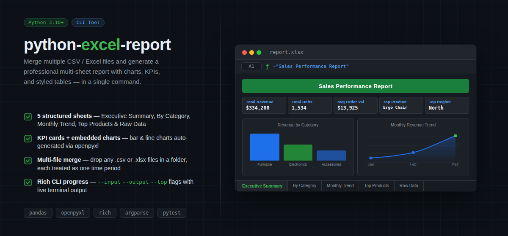

# python-excel-report

A command-line tool that merges multiple CSV or Excel files and generates a professional, multi-sheet Excel report with embedded charts and styled tables.

## What It Produces

Running the tool generates a single `report.xlsx` file with five sheets:

| Sheet | Contents |
|---|---|
| Executive Summary | Five KPI cards (total revenue, units, avg order value, top product, top region) plus a bar chart and a line chart |
| By Category | Revenue, units, and transaction count grouped by product category |
| Monthly Trend | Revenue and units aggregated per source file (month) |
| Top Products | Top N products ranked by total revenue |
| Raw Data | Full merged dataset with all original columns |



## Quick Start

```bash
# Install dependencies
pip install -r requirements.txt

# Run with built-in sample data (no arguments needed)
python -m src.main

# Open the generated report
open report.xlsx   # macOS
start report.xlsx  # Windows
```

## Options

```
python -m src.main --input ./data --output report.xlsx --top 5
```

| Flag | Default | Description |
|---|---|---|
| `--input` | `./data` | Folder containing `.csv` or `.xlsx` input files |
| `--output` | `report.xlsx` | Output file path |
| `--top` | `5` | Number of top products to include |

## Using Your Own Data

Drop any `.csv` or `.xlsx` files into a folder and point `--input` at it. Each file is treated as one time period (e.g. one month). The tool expects these columns:

| Column | Type | Description |
|---|---|---|
| `product` | string | Product name |
| `category` | string | Product category |
| `region` | string | Sales region |
| `revenue` | number | Revenue for the row |
| `units` | number | Units sold |

Extra columns are preserved in the Raw Data sheet.

## Running Tests

```bash
pip install pytest
pytest tests/
```

## Project Structure

```
python-excel-report/
├── src/
│   ├── main.py           # CLI entry point (argparse + Rich progress)
│   ├── data_loader.py    # File loading and folder merging
│   ├── analyzer.py       # Statistical summaries and KPIs
│   └── report_builder.py # openpyxl report generation
├── data/
│   ├── sample_jan.csv
│   ├── sample_feb.csv
│   └── sample_mar.csv
├── tests/
│   ├── test_data_loader.py
│   └── test_analyzer.py
├── requirements.txt
└── README.md
```

## Extending the Tool

- Add a new sheet: create a function in `analyzer.py` and call `_write_df` in `report_builder.py`
- Support new file types: extend the `load_file` function in `data_loader.py`
- Change chart styles: modify the chart functions in `report_builder.py` — openpyxl supports all standard Excel chart types

## Requirements

- Python 3.10+
- pandas
- openpyxl
- rich
